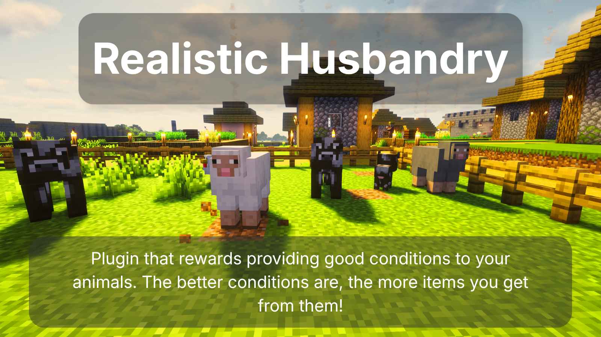

<!--
*** Thanks for checking out the Best-README-Template. If you have a suggestion
*** that would make this better, please fork the vCompat and create a pull request
*** or simply open an issue with the tag "enhancement".
*** Thanks again! Now go create something AMAZING! :D
***
***
***
*** To avoid retyping too much info. Do a search and replace for the following:
*** SourceWriters, vCompat, twitter_handle, email, vCompat, project_description
-->

<!-- PROJECT SHIELDS -->
<!--
*** I'm using markdown "reference style" links for readability.
*** Reference links are enclosed in brackets [ ] instead of parentheses ( ).
*** See the bottom of this document for the declaration of the reference variables
*** for contributors-url, forks-url, etc. This is an optional, concise syntax you may use.
*** https://www.markdownguide.org/basic-syntax/#reference-style-links
-->
[![Contributors][contributors-shield]][contributors-url]
[![Stargazers][stars-shield]][stars-url]
[![Issues][issues-shield]][issues-url]
[![GPLv3 License][license-shield]][license-url]

<h3 align="center">RealisticHusbandry</h3>

  

    <!-- TODO: project_description -->
    Plugin for Minecraft (Spigot/Paper) that rewards providing good conditions to your animals. The better conditions are, the more items you get from them!
     
     
    <a href="https://github.com/tdziurko/realistic-husbandry/issues/new?labels=Bug&template=bug_report.md&title=%5BBUG%5D+Some+bug+that+happend">Report bug</a>
    ·
    <a href="https://github.com/tdziurko/realistic-husbandry/issues/new?labels=Enhancement%2C+Priority%3A+Optional&template=feature_request.md&title=%5BFEATURE%5D+Some+feature+that+could+be+cool">Request feature</a>
  

<!-- ABOUT THE PROJECT -->
### About The Project

Animals living in good conditions are happier and gain weight faster. The happier (and the heavier) they are, 
the more loot they give when you kill them. Neglect their conditions and they even may loose weight and stop giving you any loot!
Every morning server analyzes conditions your animals are living and calculates their growth rate (positive or negative) based on several conditions. 

* keep them healthy: animals with health lower than 60% do not grow at all, the closer their health is to 100%, the faster their growth is 
* give them space: too crowded pastures prevent animals from being happy and growing
* avoid unhealthy conditions, as animals may loose weight and even do not drop anything when they are too thin 
* check state of animal by right-clicking on it
* (coming soon!) provide them with water: animals with direct access to water grow faster
* (coming soon!) give them food: animals with direct access to hay grow faster
* (coming soon!) animals on grass are happier and grow faster

Also planned:

* adjust number of eggs, wool and milk based on animals happiness and weight
* animals that are too old do not provide products at all
* increase growth rate when farmer villager is near by

**Credits**

Plugin idea taken from discussion on Reddit - [Animal Weights](https://www.reddit.com/r/Minecraft/comments/1te0m69/animal_weights_a_simple_mechanic_to_encourage/)

### Changelog

**v0.3.0 (17th May 2026)**

* weight gain/reduction depends on health and congestion around the animal
* bad conditions/environment (too crowded, too low health) and animal may loose weight
* too thin/skinny (below 1000) animals do not drop any loot 

**v0.2.0 (16th May 2026)**

* initial version of plugin, weight gain depends only on health 
* check state of animal by right-clicking on it

<!-- GETTING STARTED -->
### Using the plugin

To use RealisticHusbandry plugin on your server, download it from:

* [SpigotMC](https://www.spigotmc.org/resources/realistichusbandry.135336/)
* [Modrinth](https://modrinth.com/plugin/realistichusbandry/)

### Installation

To install the plugin you only need to do following steps:
1. Download the plugin
2. Put it into your server's plugin folder
3. Start or reload your server
4. Enjoy!

<!-- ROADMAP -->
### Roadmap

See the [open issues](https://github.com/tdziurko/realisstic-husbandry/issues) for a list of proposed features (and known issues).

<!-- CONTRIBUTING -->
### Contributing

You can help me developing this plugin by 
[reporting bugs](https://github.com/tdziurko/realistic-husbandry/issues/new?labels=Bug&template=bug_report.md&title=%5BBUG%5D+Some+bug+that+happend) 
or [requesting a new feature](https://github.com/tdziurko/realistic-husbandry/issues/new?labels=Enhancement%2C+Priority%3A+Optional&template=feature_request.md&title=%5BFEATURE%5D+Some+feature+that+could+be+cool) 

or, if you want to write some code by yourself, by forking the project and creating a Pull Request!

To do that please:
1. Fork the Project
2. Create your branch with your changes/fixes (`git checkout -b feature/newFeature` or `git checkout -b fix/fixedBug`) 
3. Commit your Changes (`git commit -m 'Meaningful message'`)
4. Push to the Branch (`git push origin <branchName>`)
5. Open a Pull Request

<!-- LICENSE -->
### License

Distributed under the GPLv3 License. See `LICENSE` for more information.

<!-- CONTACT -->
### Contact

[@TomaszDziurko](https://x.com/TomaszDziurko) - tdziurko@gmail.com

Project Link: [https://github.com/tdziurko/realistic-husbandry](https://github.com/tdziurko/realistic-husbandry)

<!-- MARKDOWN LINKS & IMAGES -->
<!-- https://www.markdownguide.org/basic-syntax/#reference-style-links -->
[contributors-shield]: https://img.shields.io/github/contributors/tdziurko/realistic-husbandry.svg?style=flat-square
[contributors-url]: https://github.com/tdziurko/realistic-husbandry/graphs/contributors
[stars-shield]: https://img.shields.io/github/stars/tdziurko/realistic-husbandry.svg?style=flat-square
[stars-url]: https://github.com/tdziurko/realistic-husbandry/stargazers
[issues-shield]: https://img.shields.io/github/issues/tdziurko/realistic-husbandry.svg?style=flat-square
[issues-url]: https://github.com/tdziurko/realistic-husbandry/issues
[license-shield]: https://img.shields.io/github/license/tdziurko/realistic-husbandry.svg?style=flat-square
[license-url]: https://github.com/tdziurko/realistic-husbandry/blob/main/LICENSE
